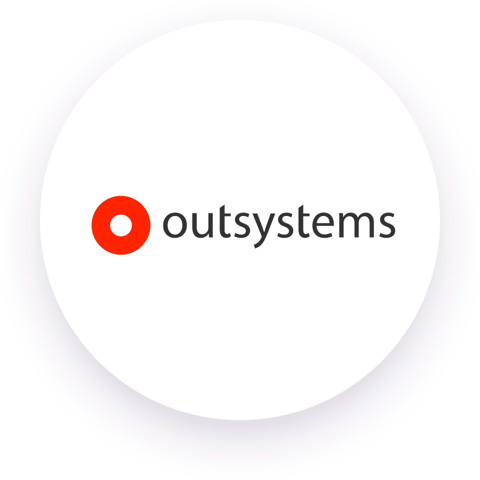

<h2 align="center">Bem-vindo(a)! ☕</h2>

  

<h2>Sobre mim</h2>
<ul>
  <li>Estudante de ADS na faculdade Senac</li>
  <li>Estudante de Cibersegurança e Ciência de Dados</li>
  <li>Desenvolvedora Fullstack na Robert Bosch Brasil</li>
</ul>

<h2>Skills</h2>

<h3>Tecnologias</h3>

  
  
  
  
  
  
  

<h3>Ambientes</h3>

  
  
  

<h2>Redes Sociais</h2>

  

